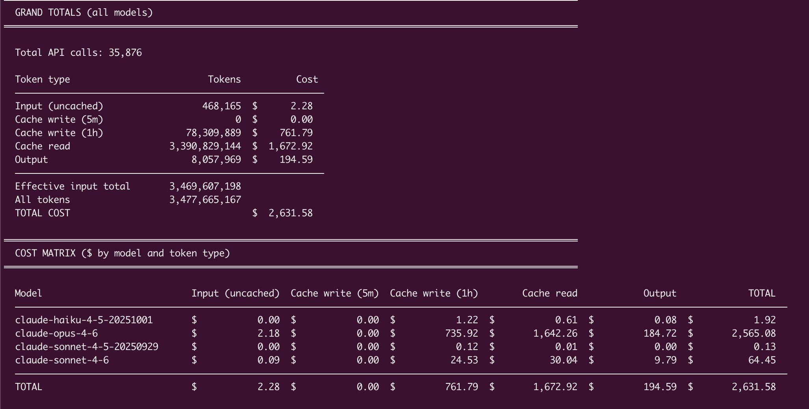

# 🧾 claude-api-usage

## **Curious what your Claude Code usage would cost at API prices?**



## ✨ What you get

- 📊 **Per-model breakdown** — input, cache write, cache read, and output tokens
- 💰 **Cost matrix** across all models and token types
- ⚡ **Cache efficiency stats** — hit rate and how much caching saved you
- 📅 **Time summary** with average monthly cost and per-model projections
- 🗂️ **Multi-project support** — single project, worktrees, or everything at once
- 🚀 **Parallel processing** for large log sets

---

## 🔌 Install as a Claude Code skill

The fastest way. Adds `/api-usage` as a slash command directly inside Claude Code.

```sh
curl -fsSL https://raw.githubusercontent.com/alfredvc/claude-api-usage/main/install.sh | sh
```

That's it. Now just ask Claude:

```
/api-usage
/api-usage /path/to/project
```

---

## 🐍 Use the script directly

Prefer running it yourself? Grab the script:

```sh
curl -fsSL https://raw.githubusercontent.com/alfredvc/claude-api-usage/main/skill/api_usage.py -o api_usage.py
```

---

## 🛠️ Usage

```
python3 api_usage.py [project_dir] [--no-subdirs] [--all]
```

| Argument | Description |
|---|---|
| `project_dir` | Path to the project root (default: current directory) |
| `--no-subdirs` | Exclude worktrees and sub-directories from the scan |
| `--all` | Scan every Claude project — your grand total across everything |

```sh
# Current project
python3 api_usage.py

# Specific project
python3 api_usage.py ~/src/my-project

# Current project only, no worktrees
python3 api_usage.py --no-subdirs

# 👀 See your total Claude spend across ALL projects
python3 api_usage.py --all
```

---

## 📋 Requirements

- Python 3.10+
- Claude Code with conversation logs in `~/.claude/projects/`
